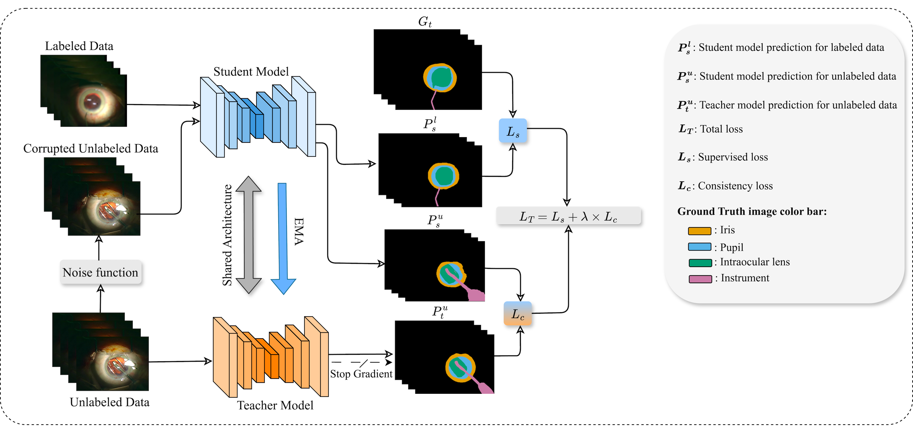

# Semi-Supervised Segmentation of Cataract Surgical Images

Official implementation of:

> **An Evaluation of the Mean Teacher Framework for Semi-Supervised Cataract Surgical Image Segmentation**  
> Mahtab Faraji, Darvin Yi, Michael J. Heiferman, Homa Rashidisabet  
> *Translational Vision Science & Technology*, 2026, 15(4):5  
> DOI: [10.1167/tvst.15.4.5](https://doi.org/10.1167/tvst.15.4.5)

---

## Overview

This repository provides the full training, validation, and test pipeline for semi-supervised semantic segmentation of cataract surgical images. We adapt the [Mean Teacher (MT)](https://arxiv.org/abs/1703.01780) framework to segment four clinically relevant structures from surgical microscope video frames:


## Repository Structure

```
├── train_mt.py                  # Mean Teacher semi-supervised training
├── train_supervised.py          # Fully supervised training (UNet / SwinUNet)
├── test_mt.py                   # Evaluation for the MT model
├── test_supervised.py           # Evaluation for supervised models
├── test_utils.py                # Shared inference, metri cs, and visualization
├── val.py                       # Validation utilities (DSC, HD95 per class)
│
├── dataloaders/
│   └── dataset.py               # Dataset, augmentation, TwoStreamBatchSampler
│
├── networks/
│   ├── net_factory.py           # Model factory (UNet-ResNet50)
│   ├── unet.py                  # UNet and UNetResnet definitions
│   └── vision_transformer.py    # SwinUNet definition
│
├── utils/
│   └── losses.py                # DiceLoss
│
└── configs/
    └── swin_tiny_patch4_window7_224_lite.yaml   # SwinUNet config
```

---

## Datasets

Three publicly available datasets are used. Download and organize them as described below before running any training or evaluation script.

**Cataract-1K** (primary training dataset)  
2,256 annotated frames from 30 cataract surgery videos. We additionally extract 40,000 unlabeled frames from the unannotated portions at 1 frame per 5 seconds.  
Download: [Synapse](https://www.synapse.org/Synapse:syn53404507)

**CaDIS** (external evaluation)  
4,670 frames annotated into 36 categories from Zeiss OPMI Lumera microscope recordings.  
Download: [Grand Challenge](https://cataracts-semantic-segmentation2020.grand-challenge.org/Data/)

**CatInstSeg** (external evaluation)  
843 frames with annotations for 11 distinct instrument types.  
Download: [ITEC FTP](https://ftp.itec.aau.at/datasets/ovid/InSegCat/)

### Expected directory layout

```
data/
├── train/
│   ├── images/          # All training frames (labeled + unlabeled together)
│   └── labels/          # Labeled frames only (grayscale PNG, pixel = class index)
├── val/
│   ├── images/
│   └── labels/
└── test/
    ├── images/
    └── labels/
```

Frames without a corresponding file in `labels/` are treated automatically as unlabeled. 

Label encoding: `0` background, `1` iris, `2` pupil, `3` intraocular lens (IOL), `4` instrument.

---

## Installation

```bash
git clone https://github.com/mahtabfaraji1/Semi-supervised-segmentation-of-cataract-surgical-images.git
cd Semi-supervised-segmentation-of-cataract-surgical-images
pip install -r requirements.txt
```

**Core dependencies:**

```
torch >= 1.12
torchvision
numpy
scipy
scikit-image
opencv-python
medpy
tqdm
Pillow
matplotlib
timm          
```

---

## Training

### Mean Teacher (semi-supervised)

```bash
python train_mt.py \
    --root_path     ./data/ \
    --labeled_num   100 \
    --unlabeled_num 40000 \
    --noise_type    gaussian_noise \
    --noise_amount  15 \
    --consistency   0.1 \
    --ema_decay     0.995 \
    --ramp_up       1000 \
    --wait_period   2500 \
    --max_iterations 40000 \
    --batch_size    24 \
    --base_lr       0.01 \
    --num_classes   5
```


**Key hyperparameters**:

| Parameter | Paper optimal | Argument |
|---|---|---|
| Consistency weight λ | 0.1 | `--consistency` |
| EMA decay α | 0.995 | `--ema_decay` |
| Noise type | Gaussian | `--noise_type` |
| Noise σ | 15 | `--noise_amount` |
| Ramp-up length | 1,000 iters | `--ramp_up` |

---

### Fully supervised baselines

**UNet-ResNet50**:

```bash
python train_supervised.py \
    --model          unet_resnet \
    --root_path      ./data/ \
    --max_iterations 40000 \
    --batch_size     24 \
    --base_lr        0.01 \
    --patch_size     256 256 \
    --num_classes    5
```

**SwinUNet**:

```bash
python train_supervised.py \
    --model          swinunet \
    --root_path      ./data/ \
    --max_iterations 40000 \
    --batch_size     24 \
    --base_lr        0.001 \
    --patch_size     224 224 \
    --num_classes    5 \
    --cfg            ./configs/swin_tiny_patch4_window7_224_lite.yaml
```

---

## Checkpoints & Pre-trained Models

Pre-trained weights and evaluation checkpoints for two of our models are included in the repository. You can find them under the `model/` folder 
You can use these paths directly in the evaluation scripts below without needing to re-train the models.
More checkpoints will be shared upon the request.

---

## Evaluation

### MT model

```bash
python test_mt.py \
    --image_dir     ./data/test/images \
    --label_dir     ./data/test/labels \
    --model_path    ./model/<exp_name>/unet_resnet_best_model.pth \
    --output_dir    ./results/mt_100labeled \
    --labeled_num   100 \
    --unlabeled_num 40000 \
    --num_classes   5
```


### Supervised models

```bash
# UNet-ResNet50
python test_supervised.py \
    --model      unet_resnet \
    --image_dir  ./data/test/images \
    --label_dir  ./data/test/labels \
    --model_path ./model/<exp_name>/unet_resnet_best_model.pth \
    --output_dir ./results/unet_resnet \
    --num_classes 5

# SwinUNet
python test_supervised.py \
    --model      swinunet \
    --image_dir  ./data/test/images \
    --label_dir  ./data/test/labels \
    --model_path ./model/<exp_name>/swinunet_best_model.pth \
    --output_dir ./results/swinunet \
    --patch_size 224 224 \
    --num_classes 5 \
    --cfg        ./configs/swin_tiny_patch4_window7_224_lite.yaml
```


## Citation

If you use this code in your work, please cite:

```bibtex
@article{faraji2026mt,
  title     = {An Evaluation of the Mean Teacher Framework for
               Semi-Supervised Cataract Surgical Image Segmentation},
  author    = {Faraji, Mahtab and Yi, Darvin and Heiferman, Michael J.
               and Rashidisabet, Homa},
  journal   = {Translational Vision Science \& Technology},
  volume    = {15},
  number    = {4},
  pages     = {5},
  year      = {2026},
  doi       = {10.1167/tvst.15.4.5}
}
```

The Mean Teacher framework is based on:

```bibtex
@article{tarvainen2017mean,
  title   = {Mean teachers are better role models: Weight-averaged consistency
             targets improve semi-supervised deep learning results},
  author  = {Tarvainen, Antti and Valpola, Harri},
  journal = {arXiv preprint arXiv:1703.01780},
  year    = {2017}
}
```

---

## Acknowledgments

**Funding:** Supported by an Unrestricted Grant from Research to Prevent Blindness, a generous donation from the Cless Family Foundation, and NIH P30 EY001792 Core Grant.

**Codebase:** This project builds on the [SSL4MIS](https://github.com/HiLab-git/SSL4MIS) repository by Xiangde Luo et al. (HiLab, UESTC), which provides open-source implementations of semi-supervised learning methods for medical image segmentation. We adapted the Mean Teacher training loop, TwoStreamBatchSampler, and several utility components from that codebase. We thank the authors for making their code publicly available.

---


